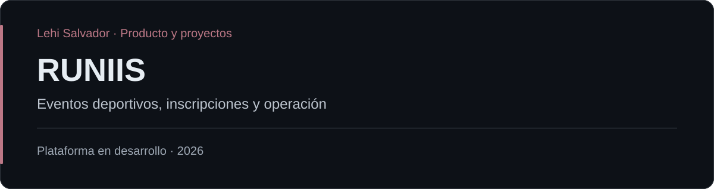

# RUNIIS

RUNIIS es una plataforma para carreras, maratones, hikes y eventos deportivos propios de la marca. Su modelo combina una experiencia pública para participantes con herramientas administrativas para configurar, promocionar y operar eventos.

## Participación

Lehi Salvador — definición de producto, planificación por fases y coordinación de ejecución con Claude, agentes especializados y SalvaOps.

## Alcance

- Descubrimiento de eventos, rutas y modalidades.
- Perfiles e inscripciones de participantes.
- Configuración, promoción y operación administrativa.
- Comunicación por email y pases individuales con QR.
- Check-in, asistencia, rankings e insignias dentro del alcance definido.

## Estado y contexto

Cuenta con repositorio propio e infraestructura Supabase de staging y producción. El producto continúa en desarrollo por fases. La lista describe alcance de producto; disponibilidad de cada función depende de la fase de implementación.

## Tecnologías

Supabase, QR, workflows con Claude y agentes especializados, GitHub y SalvaOps.

## Enlaces

- [Portafolio de Lehi Salvador](https://github.com/LehiSalvador)
- [Salva Systems](https://salvasystems.site)
- [Sitio del proyecto](https://runiismty.com)
